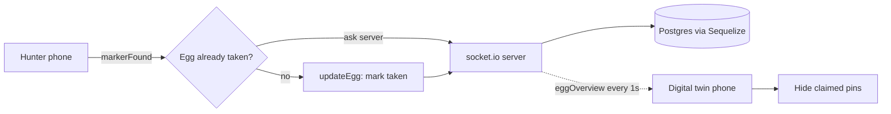

# Egghunt

Compete to find AR Easter eggs and watch the game live from the digital twin.

## Why I built it

A 2022 project from my BSc in Product Design. I wanted a campus Easter egg hunt that ran on the phone people already carry, with no app to install. Hunters walk the campus and scan printed markers to reveal hidden 3D eggs in AR. Everyone else can point a phone at one shared marker and get a scale model of the whole campus, its pins winking out as eggs get claimed. Two roles, one game: play it on the ground, or watch it from above.

## What it does

- Marker-based AR: scanning a printed barcode marker reveals a 3D egg anchored on it
- Claiming an egg is checked against the server first, so two people cannot take the same egg
- A digital twin: one marker shows the whole campus as a model, with a live pin per egg
- Pins vanish from the twin as their eggs are found, close to real time
- Discovery sound effects and a fade-and-animate reveal on each egg
- Teams with points, backed by a Postgres schema

## How it works

The frontend is A-Frame with AR.js. The backend is Express with socket.io, and Sequelize over Postgres holds the egg (`trigger`) and `team` state. Every phone talks to the same socket server, which keeps hunters and the twin in sync.



### Marker handling and shared state

The eggs use AR.js barcode markers in matrix mode (`detectionMode: mono_and_matrix`, `matrixCodeType: 3x3`). Each egg is a cheap printed 3x3 code. One more code (value 63) stands in for the campus twin. When AR.js fires `markerFound`, the client fades the egg model in right away, then emits `eggStatus` over socket.io to check whether that egg's row is already `taken`. If it is free, it plays the discovery sound, animates the egg away, and emits `updateEgg` to flip the row in Postgres. The server also broadcasts the full egg roster on `eggOverview` once a second. The twin client hides each pin whose egg has been claimed, so a spectator sees a capture land within about a second.

### The egg shows up as a ghost

When a marker comes into view, its egg loads at 30% opacity, a translucent preview traversed onto every mesh in the model. The client then checks the egg's state on the server. If the egg is unclaimed, the mesh snaps to full opacity, a discovery sound plays, and after a beat it animates away to mark the catch. An egg that is already taken stays at low opacity, a ghost you cannot pick up.

### The campus model

The overhead campus model came out of Google Earth. There was no clean way to export its geometry at the time, so I pulled it from the graphics buffer. I captured a frame of the campus in Google Earth with RenderDoc, a graphics debugger that dumps the GPU draw calls, geometry, and textures. Then I rebuilt the meshes and textures from that capture with the MapsModelsImporter add-on for Blender, and cleaned it up for the scene.

## Tech stack

- Frontend: A-Frame 1.3, AR.js (barcode/matrix markers), socket.io-client, Webpack
- Backend: Node, Express, socket.io, Sequelize
- Data: PostgreSQL
- Assets: GLTF eggs and a campus model

## Repo layout

```
egghunt/
  frontend/   A-Frame + AR.js client (markers, eggs, the digital twin)
  backend/    Express + socket.io + Sequelize game server
```

## Running it

AR needs the camera and https, so the frontend dev server runs over https.

```bash
# frontend
cd frontend
yarn install
yarn start        # webpack-dev-server over https

# backend
cd backend
npm install
npm start         # runs ./bin/www
```

The backend expects a Postgres database configured in `backend/config/config.json`. Run the Sequelize migrations and seeders under `backend/migrations` and `backend/seeders` to set it up. One thing to know if you clone this: the client's socket endpoint is hardcoded to the original Heroku backend, which is offline now, so repoint it at your own server. The egg and campus GLTF assets load from a Glitch CDN.

## Status

Prototype from 2022. It proves the two-role idea (play on the ground, watch from the twin), and it never went past that.
