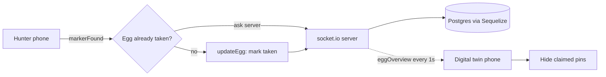

# Egghunt

Compete to find AR Easter eggs and watch the game live from the digital twin.

## Why I built it

This was a 2022 project from my BSc in Product Design. I wanted a campus Easter egg hunt that worked on the phone people already carry, with no app install. Hunters walk the campus and scan printed markers to reveal hidden 3D eggs in augmented reality. Anyone else can point their phone at one shared marker and see a scale model of the whole campus, with pins that disappear as eggs get claimed. So the hunt has two roles at once: you play it on the ground, or you watch it from above.

## What it does

- Marker-based AR: scanning a printed barcode marker reveals a 3D egg anchored on it
- Claiming an egg is checked against the server first, so two people cannot take the same egg
- A digital twin: one marker shows the whole campus as a model, with a live pin per egg
- Pins vanish from the twin as their eggs are found, close to real time
- Discovery sound effects and a fade-and-animate reveal on each egg
- Teams with points, backed by a Postgres schema

## How it works

The frontend is A-Frame with AR.js. The backend is Express with socket.io, and Sequelize over Postgres holds the egg (`trigger`) and `team` state. Every phone in the game talks to the same socket server, which is what keeps the hunters and the digital twin in sync.



### Marker handling and shared state

The eggs use AR.js barcode markers in matrix mode (`detectionMode: mono_and_matrix`, `matrixCodeType: 3x3`), so each egg is a cheap printed 3x3 code rather than a trained image target, and one more code (value 63) stands in for the campus twin. When AR.js fires `markerFound`, the client fades the egg model in optimistically, then emits `eggStatus` over socket.io to ask whether that egg's row is already `taken`. Only if it is not does it play the discovery sound, animate the egg away, and emit `updateEgg` to flip the row in Postgres. Meanwhile the server broadcasts the full egg roster on `eggOverview` once a second, and the twin client hides each pin whose egg has been claimed, so a spectator sees captures land within about a second of them happening.

## Tech stack

- Frontend: A-Frame 1.3, AR.js (barcode/matrix markers), socket.io-client, Webpack
- Backend: Node, Express, socket.io, Sequelize
- Data: PostgreSQL
- Assets: GLTF eggs and a campus model

## Repo layout

```
egghunt/
  frontend/   A-Frame + AR.js client (markers, eggs, the digital twin)
  backend/    Express + socket.io + Sequelize game server
```

## Running it

AR needs the camera and https, so the frontend dev server runs over https.

```bash
# frontend
cd frontend
yarn install
yarn start        # webpack-dev-server over https

# backend
cd backend
npm install
npm start         # runs ./bin/www
```

The backend expects a Postgres database configured in `backend/config/config.json`, then the Sequelize migrations and seeders under `backend/migrations` and `backend/seeders`. Two things to know if you clone this: the client's socket endpoint is hardcoded to the original Heroku backend, which is no longer running, so point it at your own server, and the egg and campus GLTF assets are loaded from a Glitch CDN.

## Status

Prototype from 2022, consolidated from the former `eggFront` and `eggBack` repos with history preserved. It is a proof of the two-role idea (play on the ground, watch from the twin) rather than a finished product.
